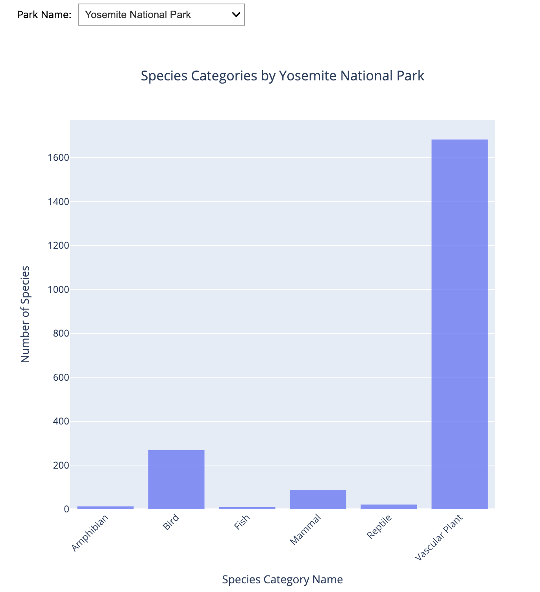

## Visualizations
Here are the visualizations generated from the analysis using the dataset from Tidy Tuesday.

1. **Species Categories Across Parks** 
  

2. **Species Category by Park** 
  

## Data Source

The dataset used for this analysis is from Tidy Tuesday's [Oct 8, 2024 dataset](https://github.com/rfordatascience/tidytuesday/tree/master/data/2024/2024-10-08).
